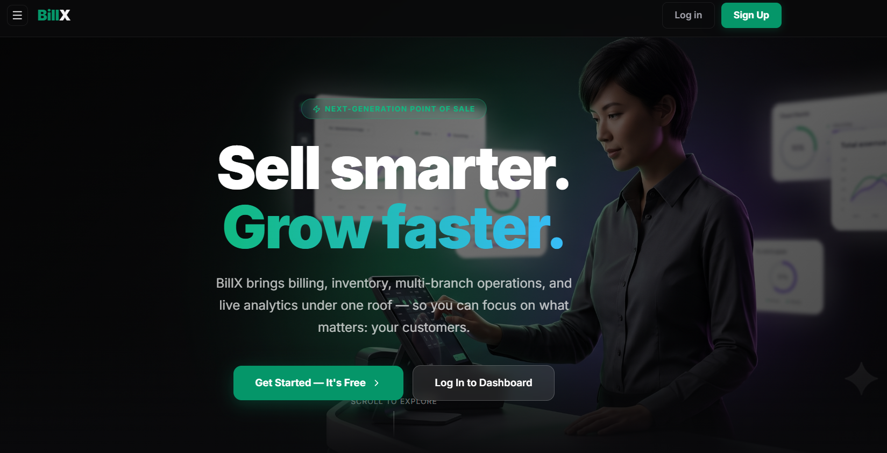
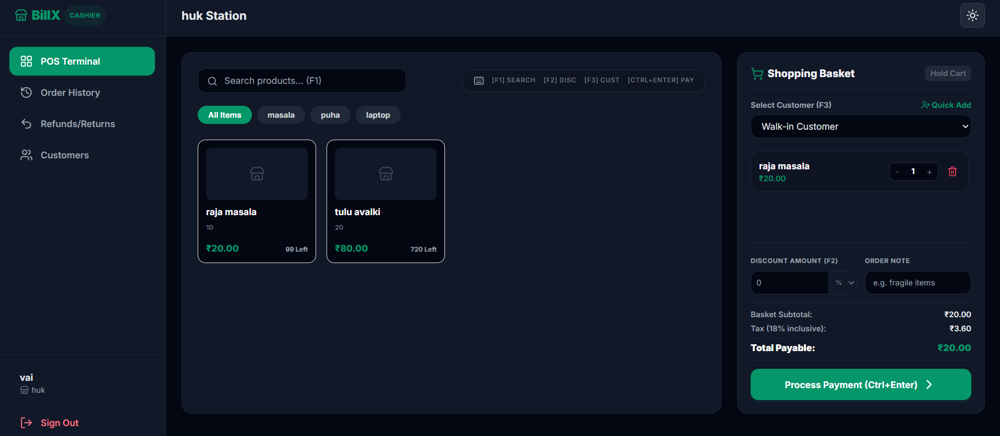
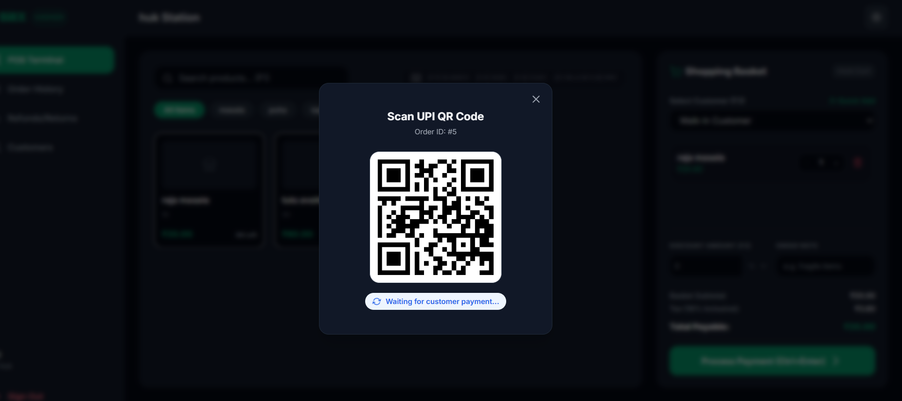
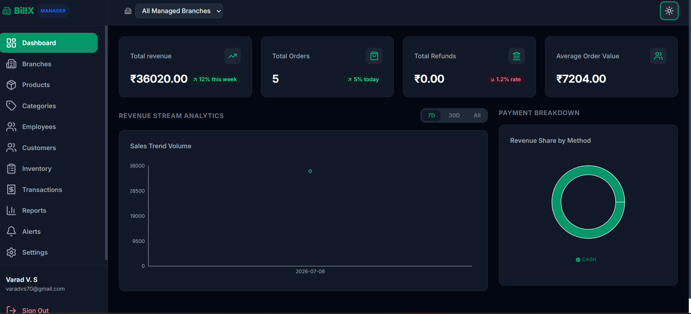
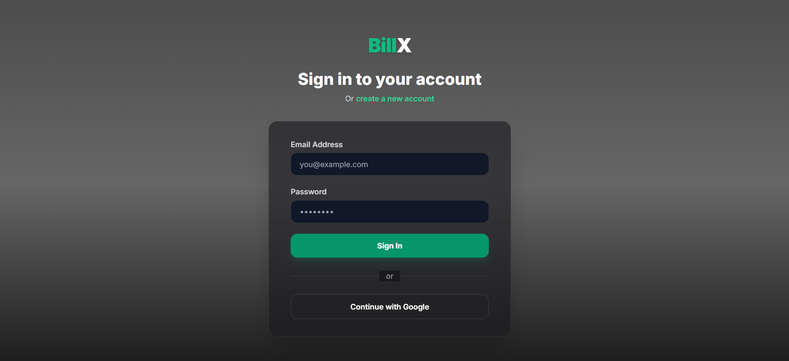
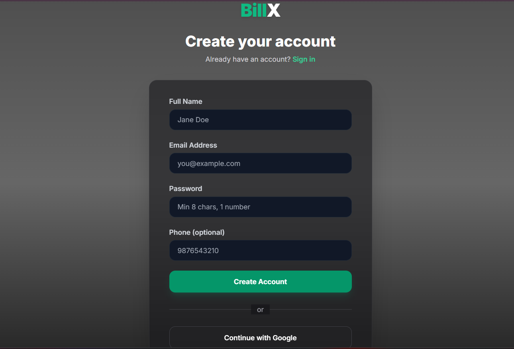

# BillX — Next-Generation Point of Sale (POS) System

BillX is a premium, full-stack Point of Sale (POS) application designed to modernize retail billing, cashier terminal workflows, multi-branch management, and real-time inventory tracking.

Built with a high-performance **Spring Boot (Java)** backend and a sleek, dynamic **React (Vite)** frontend, BillX replaces complex spreadsheets with an automated, real-time retail command center.

---

## 🚀 Key Features

### 💻 1. Cashier POS Terminal
* **Blazing-Fast Checkouts:** Keyboard-first terminal designed for rapid item scans, barcode search, and category filtering.
* **Smart Cart Management:** Client-side Redux-managed cart with instant subtotal, tax, and discount computations.
* **Flexible Payments:** Supports Cash, Card, and instant UPI QR payments.

### 💳 2. Multi-Branch UPI QR Payments (Razorpay)
* **Dynamic QR Codes:** Generates a custom UPI QR code for each transaction mapped directly to the order total.
* **Direct Settlement:** Supports per-branch Razorpay accounts—payments settle directly into the local branch's bank account.
* **Instant Webhooks:** Webhook-driven payment confirmation updates cashier screens instantly upon customer payment.

### 📦 3. Real-Time Inventory & Multi-Branch Control
* **Low-Stock Alerts:** Automatic thresholds trigger dashboard warnings and notifications when items run low.
* **Inventory Logs:** Complete audit trail tracking restocks, stock adjustments, and sales.
* **Role-Based Access (RBAC):** Restrict views between cashiers (terminal access only) and managers (dashboard, analytics, settings).

### 📊 4. Manager Analytics & Reports
* **Live Dashboards:** Visualized analytics using Recharts covering revenue, payment breakdown, sales history, and branch performance.
* **Automated Weekly PDF Reports:** Spring Boot Scheduler compiles weekly performance data into structured PDF reports and automatically emails them to branch managers.

---

## 🛠️ Tech Stack & Integrations

### Frontend
* **Core:** React 19 + Vite (JavaScript)
* **State Management:** Redux Toolkit (`@reduxjs/toolkit` & `react-redux`)
* **Form & Validation:** Formik + Yup
* **Charts & Icons:** Recharts & Lucide React
* **Styling:** TailwindCSS 3.4 (with customized dark mode support)

### Backend
* **Core:** Spring Boot 3 (Java 17)
* **Persistence:** Spring Data JPA + Hibernate
* **Security:** Spring Security + JWT Bearer Tokens
* **Docs & API Test:** Swagger / OpenAPI

### Third-Party Services
* **Database:** MySQL / PostgreSQL (Neon / Supabase / Aiven)
* **Authentication:** Google OAuth2 API
* **Payments:** Razorpay API (UPI QR generation & Webhooks)
* **Storage:** Cloudinary API (secure cloud hosting for product images)
* **Email Notification:** SMTP Mail Sender (Gmail SMTP integration)

---

## 📁 Repository Structure

```text
BillX/
├── Frontend/                      # React SPA (Vite)
│   ├── public/                    # Static public assets
│   ├── src/
│   │   ├── components/            # Reusable UI widgets
│   │   ├── pages/                 # Cashier and Manager modules
│   │   ├── layouts/               # Main layout containers
│   │   ├── redux/                 # Slices & Global Store configurations
│   │   └── utils/                 # API axios configurations
│   └── tailwind.config.js
└── Backend/                       # Spring Boot Application
    ├── src/main/java/.../BillX/
    │   ├── config/                # Cloudinary, security, & Razorpay configs
    │   ├── controller/            # REST API endpoints
    │   ├── dto/                   # Data Transfer Objects
    │   ├── entity/                # Database entities / schemas
    │   ├── repository/            # JPA repositories
    │   ├── service/               # Business logic interfaces
    │   ├── serviceimpl/           # Service implementations
    │   └── util/                  # PDF generators & utility helpers
    ├── pom.xml
    └── schema-migration.sql       # Reference SQL migration file
```

---

## 🛠️ Local Setup & Configuration

### Prerequisites
* **Java Development Kit (JDK) 17**
* **Node.js (v18+) & npm**
* **PostgreSQL / MySQL Instance**

### 1. Database Setup
Create a database named `billx` and run the queries inside `/Backend/schema-migration.sql` or `/schema-migration.sql` to initialize tables, insert branches, employee roles, and sample products.

### 2. Backend Configurations
Navigate to `/Backend/src/main/resources/application.properties` (or create `/Backend/.env` / `.env` in the root) and add:
```properties
# Database Configs
spring.datasource.url=jdbc:mysql://localhost:3306/billx
spring.datasource.username=root
spring.datasource.password=your_password

# Google OAuth2 Credentials
spring.security.oauth2.client.registration.google.client-id=YOUR_GOOGLE_CLIENT_ID
spring.security.oauth2.client.registration.google.client-secret=YOUR_GOOGLE_CLIENT_SECRET

# Razorpay Keys
razorpay.key.id=rzp_test_YOUR_KEY_ID
razorpay.key.secret=YOUR_KEY_SECRET
razorpay.webhook.secret=YOUR_WEBHOOK_SECRET

# Cloudinary Configs
cloudinary.cloud-name=YOUR_CLOUD_NAME
cloudinary.api-key=YOUR_API_KEY
cloudinary.api-secret=YOUR_API_SECRET

# JWT & CORS Configurations
jwt.secret=YOUR_64_CHARACTER_JWT_HEX_SECRET
frontend.url=http://localhost:5173

# SMTP Mail Configurations
spring.mail.host=smtp.gmail.com
spring.mail.port=587
spring.mail.username=your_email@gmail.com
spring.mail.password=your_app_password
```
Run the backend with:
```bash
mvn spring-boot:run
```

### 3. Frontend Configurations
Navigate to `Frontend/` folder. Create a `.env` file and set:
```env
VITE_API_BASE_URL=http://localhost:8082
```
Install dependencies and start development server:
```bash
npm install
npm run dev
```

---

## 📸 Screenshots

Here is a preview of the BillX platform interface:

### 1. Landing Page


### 2. Cashier POS Billing Terminal


### 3. Razorpay UPI QR Code Generator


### 4. Manager Dashboard & Recharts Analytics


### 5. Sales & Transaction History


### 6. PDF Report Schedules


### 7. Sign In Page


### 8. Sign Up Page

